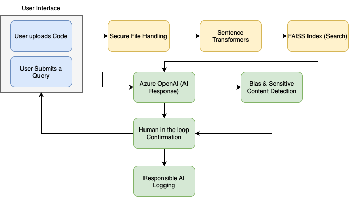

# NexusCode AI  
**The agentic AI platform that bridges code, context, and conversation.**  
*Code Analyzer with Responsible AI and Human-in-the-Loop*

An AI-powered system to upload, analyze, and query code files, implementing Responsible AI practices like bias detection, human review, and secure design patterns.

Built using **FastAPI**, **Azure OpenAI**, **Sentence Transformers**, and **FAISS** vector search.

---

## Table of Contents

- [Features](#features)
- [API Endpoints](#api-endpoints)
- [Tech Stack](#tech-stack)
- [Sample Usage](#sample-usage)
- [Responsible AI Commitment](#responsible-ai-commitment)
- [Setup Instructions](#setup-instructions)
- [Why This Project Stands Out](#why-this-project-stands-out)

## Features

### Upload and Index Code Files

- Upload `.py`, `.js`, or `.java` files.
- Code is vectorized using **Sentence Transformers**.
- Embeddings are stored in a **FAISS** index for fast semantic search.

### AI-Powered Code Query

- Query uploaded code using natural language.
- Uses FAISS to retrieve the most relevant code snippet.
- Passes query and code snippet to Azure OpenAI for expert, step-by-step explanation.

### Bias and Sensitive Content Detection

- AI-generated responses are scanned for:
  - Bias
  - Sensitive topics (e.g., race, religion, gender, violence, politics)
- Warnings are added and logged when such content is detected.

### Human-in-the-Loop Confirmation

- AI responses are saved in a pending state.
- Requires human confirmation before finalization.
- Enables safe, responsible AI deployment.

### Responsible AI Logging

- All outputs, bias detections, and human decisions are logged in `responsible_ai.log`.
- Ensures transparency and auditability.

### Code Documentation Features

- **Code Summarization**: Counts classes, functions, and lines.
- **Docstring Extraction**: Identifies existing or missing docstrings.
- **Inline Code Commenting**: Automatically adds basic inline comments.

### Secure and Scalable Design

- Uploads validated for specific file types.
- Uses `DefaultAzureCredential` for Azure identity and security.
- FAISS index persistence for session resilience.
- Modular, clean architecture using **FastAPI** best practices.

---

## API Endpoints

| Method | Endpoint     | Description                                 |
|--------|--------------|---------------------------------------------|
| POST   | `/upload/`   | Upload a code file (`.py`, `.js`, `.java`)  |
| POST   | `/query`     | Submit a query about the uploaded code      |
| POST   | `/confirm`   | Confirm or reject an AI-generated response  |
| GET    | `/`          | Health check                                |

---

## Tech Stack

- **FastAPI** — API framework  
- **Azure OpenAI** — LLM backend  
- **FAISS** — Semantic vector search  
- **Sentence Transformers** — Code and text embeddings  
- **Radon** — Code complexity analysis  
- **Pydantic** — Data model validation  
- **Python 3.9+**

---

## Sample Usage

### 1. Upload Code File

**Endpoint:** `POST /upload/`  
**Form Field:** `file` (contains `.py`, `.js`, or `.java` file)

### 2. Query Code

**Endpoint:** `POST /query`  
**Request JSON:**

{
  "query": "How is the database connection handled?"
}

## 3. Confirm or Reject AI Response

**Endpoint:** `POST /confirm`

**Request JSON:**

{
  "response_id": "b7f7f...",
  "confirm": true
}

## Responsible AI Commitment

This project adheres to Microsoft's Responsible AI principles:

- **Fairness**: Detects and warns about bias or sensitive content.
- **Accountability**: Human approval before response is finalized.
- **Transparency**: All outputs and decisions are logged.
- **Security**: Secure file handling and credential management.
- **Reliability**: Human fallback when AI uncertainty is high.

---

## Setup Instructions

### 1. Clone the Repository

git clone https://github.com/swapnilvshekade/nexuscode_ai.git
cd nexuscode_ai

### 2. Install Dependencies

pip install -r requirements.txt

### 3. Set Environment Variables

export AZURE_OPENAI_ENDPOINT="https://your-endpoint.openai.azure.com/"  
export AZURE_OPENAI_KEY="your-api-key"  
export AZURE_OPENAI_DEPLOYMENT="your-deployment-name"

### 4. Run the Server

uvicorn main:app --host 0.0.0.0 --port 5001

---

## Why This Project Stands Out

- ✅ Full implementation of Responsible AI  
- ✅ Real-world human-in-the-loop workflow  
- ✅ Modular and scalable design using modern frameworks  
- ✅ Semantic search with FAISS  
- ✅ Automatic documentation and summarization of code  
- ✅ Secure, auditable, and production-ready  
